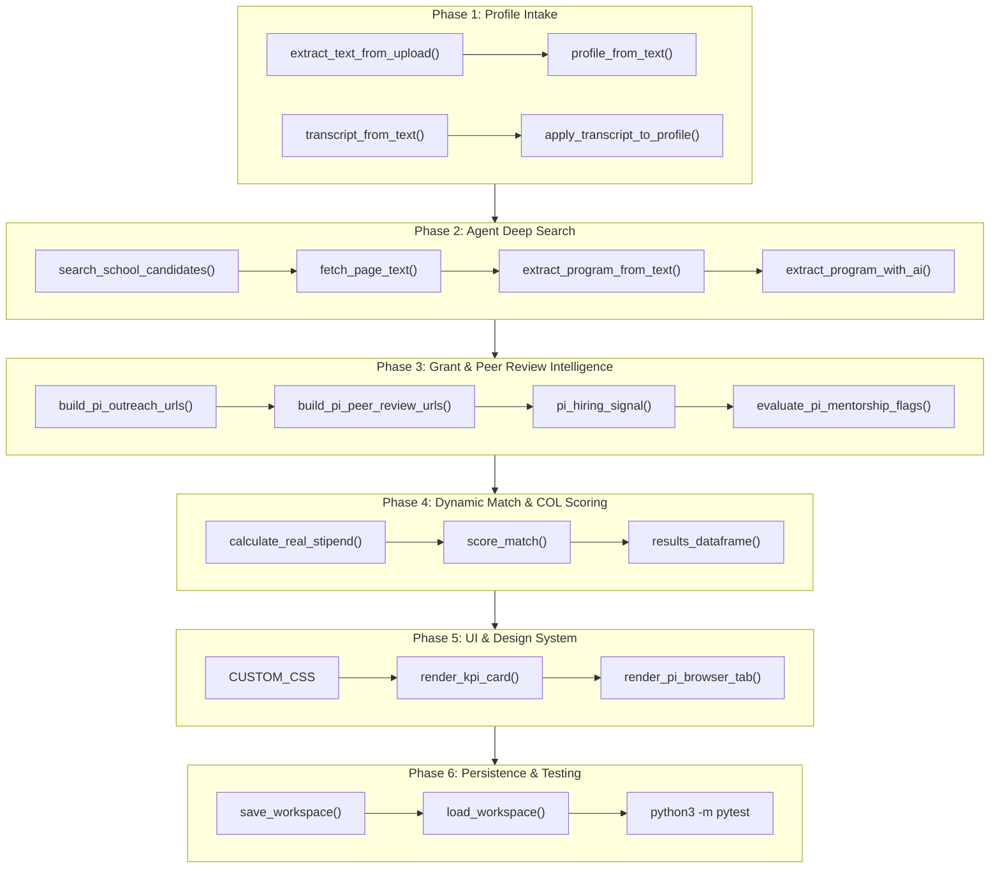

# Detailed Function & I/O Pipeline Plan

Detailed function-by-function specification for the 6-phase **GradPath Planner** Web App Pipeline, documenting exact parameters, return types, data schemas, and module locations.

---

## Pipeline Data Flow

---

## Detailed Function Specifications

### Phase 1: Intake, File Upload & Profile Parsing

#### 1. `extract_text_from_upload(filename: str, content_bytes: bytes) -> str`
- **Module Location**: [gradpath/profile_import.py](file:///Users/chenyixin/Documents/Grad%20School%20Analysis/gradpath/profile_import.py#L39)
- **Input Parameters**: `filename` (`str`), `content_bytes` (`bytes`).
- **Output Return**: `text` (`str`) (LaTeX macros stripped if `.tex`, PDF text extracted via `pypdf`).

#### 2. `profile_from_text(text: str, base_profile: dict[str, Any]) -> dict[str, Any]`
- **Module Location**: [gradpath/profile_import.py](file:///Users/chenyixin/Documents/Grad%20School%20Analysis/gradpath/profile_import.py#L58)
- **Input Parameters**: `text` (`str`), `base_profile` (`dict[str, Any]`).
- **Output Return**: `updated_profile` (`dict[str, Any]`).

---

### Phase 2: Agent Deep Search & Web Scraping

#### 1. `search_school_candidates(school: str, field: str, degree: str, max_results: int) -> list[dict[str, str]]`
- **Module Location**: [gradpath/school_research.py](file:///Users/chenyixin/Documents/Grad%20School%20Analysis/gradpath/school_research.py#L22)
- **Input Parameters**: `school` (`str`), `field` (`str`), `degree` (`str`), `max_results` (`int`).
- **Output Return**: `candidates` (`list[dict[str, str]]`).

#### 2. `fetch_page_text(url: str) -> tuple[str, str]`
- **Module Location**: [gradpath/school_research.py](file:///Users/chenyixin/Documents/Grad%20School%20Analysis/gradpath/school_research.py#L46)
- **Input Parameters**: `url` (`str`).
- **Output Return**: `(title, main_text)` (`tuple[str, str]`).

#### 3. `extract_program_from_text(text: str, url: str, target_field: str, degree_hint: str, title: str) -> dict[str, Any]`
- **Module Location**: [gradpath/school_research.py](file:///Users/chenyixin/Documents/Grad%20School%20Analysis/gradpath/school_research.py#L110)
- **Input Parameters**: `text`, `url`, `target_field`, `degree_hint`, `title` (`str`).
- **Output Return**: `program` (`dict[str, Any]`).

---

### Phase 3: Grant & Peer Review Intelligence (NSF, NIH, DARPA & Mentorship Safety)

#### 1. `build_pi_outreach_urls(prof_name: str, university: str = "") -> dict[str, str]`
- **Module Location**: [gradpath/matching.py](file:///Users/chenyixin/Documents/Grad%20School%20Analysis/gradpath/matching.py#L916)
- **Input Parameters**: `prof_name` (`str`), `university` (`str`).
- **Output Return**: `urls` (`dict[str, str]`) (NSF Awards, NIH RePORTER, Google Scholar, LinkedIn, X/Twitter, Lab Homepage).

#### 2. `build_pi_peer_review_urls(prof_name: str, university: str = "") -> dict[str, str]`
- **Module Location**: [gradpath/matching.py](file:///Users/chenyixin/Documents/Grad%20School%20Analysis/gradpath/matching.py#L952)
- **Input Parameters**: `prof_name` (`str`), `university` (`str`).
- **Output Return**: `review_urls` (`dict[str, str]`):
  - `"ratemyprofessors"`: `https://www.ratemyprofessors.com/search/professors?q=...`
  - `"reddit_peer_review"`: `https://www.google.com/search?q=site%3Areddit.com%2Fr%2FGradAdmissions+...`
  - `"rateyourpi"`: `https://www.google.com/search?q=site%3Arateyourpi.com+...`
  - `"lab_alumni_placements"`: `https://www.google.com/search?q=...+lab+alumni+phd+graduates+placements`

#### 3. `pi_hiring_signal(prof_name: str, note_text: str = "") -> dict[str, Any]`
- **Module Location**: [gradpath/matching.py](file:///Users/chenyixin/Documents/Grad%20School%20Analysis/gradpath/matching.py#L930)
- **Input Parameters**: `prof_name` (`str`), `note_text` (`str`).
- **Output Return**: `signal` (`dict[str, Any]`) (`"hiring_badge"`, `"level"`, `"reason"`).

#### 4. `evaluate_pi_mentorship_flags(prof_name: str, note_text: str = "") -> dict[str, Any]`
- **Module Location**: [gradpath/matching.py](file:///Users/chenyixin/Documents/Grad%20School%20Analysis/gradpath/matching.py#L965)
- **Input Parameters**: `prof_name` (`str`), `note_text` (`str`).
- **Output Return**: `mentorship` (`dict[str, Any]`):
  - `"badge"`: `"🚩 Red Flag Alert (Peer Review Warning)"` | `"🟩 Highly Recommended Mentor"` | `"⚪ Mentorship Unchecked"`.
  - `"safety"`: `"Caution"` | `"Safe"` | `"Unverified"`.
  - `"red_flags"`: Matched warning keywords (`toxic`, `micromanage`, `abusive`, `dropout`, `7 years`, `delay`).
  - `"green_flags"`: Matched positive keywords (`supportive`, `great mentor`, `4 years`, `5 years`, `alumni`).

---

### Phase 4: Dynamic Match Scoring & Cost-of-Living Calibration

#### 1. `calculate_real_stipend(stipend_amount: float | int, location: str = "") -> dict[str, Any]`
- **Module Location**: [gradpath/matching.py](file:///Users/chenyixin/Documents/Grad%20School%20Analysis/gradpath/matching.py#L207)
- **Input Parameters**: `stipend_amount` (`float | int`), `location` (`str`).
- **Output Return**: `{"nominal": int, "col_index": float, "real_stipend": int, "tier": str}`.

#### 2. `score_match(program: dict, profile: dict, custom_weights: dict | None = None) -> MatchResult`
- **Module Location**: [gradpath/matching.py](file:///Users/chenyixin/Documents/Grad%20School%20Analysis/gradpath/matching.py#L243)
- **Input Parameters**: `program`, `profile` (`dict`), `custom_weights` (`dict | None`).
- **Output Return**: `MatchResult` dataclass.

#### 3. `results_dataframe(programs: list[dict], profile: dict, custom_weights: dict | None = None) -> pd.DataFrame`
- **Module Location**: [gradpath/export.py](file:///Users/chenyixin/Documents/Grad%20School%20Analysis/gradpath/export.py#L19)
- **Input Parameters**: `programs`, `profile` (`dict`), `custom_weights` (`dict | None`).
- **Output Return**: `df` (`pd.DataFrame`).

---

### Phase 5: UI & Design System Components

#### 1. `render_kpi_card(label: str, value: Any, subtext: str = "", badge_class: str = "") -> str`
- **Module Location**: [gradpath/ui/theme.py](file:///Users/chenyixin/Documents/Grad%20School%20Analysis/gradpath/ui/theme.py#L182)
- **Input Parameters**: `label`, `value`, `subtext`, `badge_class`.
- **Output Return**: Glassmorphic HTML card string.

#### 2. `render_pi_browser_tab(programs: list[dict[str, Any]]) -> None`
- **Module Location**: [app.py](file:///Users/chenyixin/Documents/Grad%20School%20Analysis/app.py#L1273)
- **Input Parameters**: `programs` (`list[dict[str, Any]]`).
- **Output Return**: `None` (Renders PI browser, hiring badges, mentorship red-flag badges, 6 outreach links, and 4 peer-review links).

---

### Phase 6: Workspace Persistence & Test Suite Verification

#### 1. `load_workspace(filepath: Path | str | None = None) -> dict[str, Any]`
- **Module Location**: [gradpath/persistence.py](file:///Users/chenyixin/Documents/Grad%20School%20Analysis/gradpath/persistence.py#L25)
- **Input Parameters**: `filepath` (`Path | str | None`).
- **Output Return**: `workspace` (`dict[str, Any]`).

#### 2. `save_workspace(data: dict[str, Any], filepath: Path | str | None = None) -> bool`
- **Module Location**: [gradpath/persistence.py](file:///Users/chenyixin/Documents/Grad%20School%20Analysis/gradpath/persistence.py#L40)
- **Input Parameters**: `data` (`dict[str, Any]`), `filepath` (`Path | str | None`).
- **Output Return**: `success` (`bool`).
